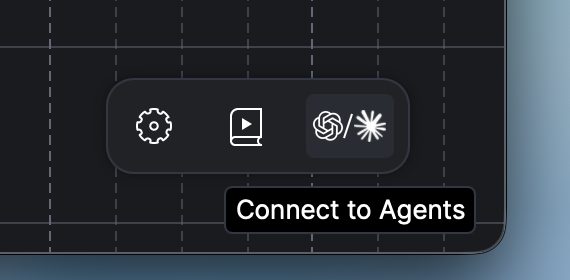

# ACE Studio agent skills

[](LICENSE)
[](#claude-code)
[](#codex)
[](https://skills.sh/BeatMagic/acestudio_agent_plugin)

Official agent skills for [ACE Studio](https://www.acestudio.ai), the all-in-one AI music studio. Installed in Claude Code or Codex through a plugin, or in any skills-capable agent through the [skills](https://skills.sh) CLI, they let the agent create and edit a music project through ACE Studio's CLI and MCP surface: tracks, vocals, instruments, effects, stems, and exports.

## Quick start

Click **Connect to Agents** in ACE Studio's bottom-right toolbar to get the instructions.

<p align="center"></p>

Or read the [External Agent Access](https://docs.acestudio.ai/ai-agent/external-agent-access) docs if you want more detail.

## Install the skills

### Copy this prompt

Paste this into your agent; it picks the right route for the harness it is running in:

```text
Install this ACE Studio agent plugin so I can connect ACE Studio with you. Check if there's a plugin for your harness and use it if available; otherwise install the skills with `npx skills add BeatMagic/acestudio_agent_plugin`. Then help me set up the CLI/MCP connection so we can actually connect.
```

The routes below are for reference or if you prefer doing things by hand. They only install the skills; the CLI/MCP connection still has to be set up separately (see [Quick start](#quick-start)).

### Claude Code

```text
/plugin marketplace add BeatMagic/acestudio_agent_plugin
/plugin install acestudio@acestudio
```

Auto-update is off by default for third-party marketplaces. Enable it once under `/plugin` → Marketplaces; to update by hand, run `/plugin marketplace update acestudio`.

### Codex

```text
codex plugin marketplace add BeatMagic/acestudio_agent_plugin
codex plugin add acestudio@acestudio
```

Codex refreshes configured marketplaces at startup, so new commits arrive without re-installing.

### Other agents

For harnesses we ship no plugin for, install the skills with the [skills](https://skills.sh) CLI:

```text
npx skills add BeatMagic/acestudio_agent_plugin
```

Updates on this route are manual: `npx skills check` shows what is out of date, then `npx skills update` pulls it. The plugin routes above update without re-installing.

<details>
<summary>Manual copy</summary>

Copy the folders under [`skills/`](skills/) into `~/.agents/skills/`, or into your harness's own skills folder if it has one.

Manually copied skills do not update with the repository.

</details>

## Scope and limitations

- **Experimental.** Things may change under the hood. It updates quickly, so remember to update.
- **Same machine.** Run your agent with ACE Studio on the same computer.

## Credits

Parts of `ace-studio-workflows` are adapted from [To-Sheet-Music-Skill](https://github.com/kiri603/To-Sheet-Music-Skill) by kiri603, under the MIT License.

## License

MIT © 2026 Timedomain Inc. Third-party tools and materials referenced by these skills remain under their own licenses.
